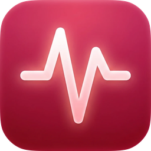
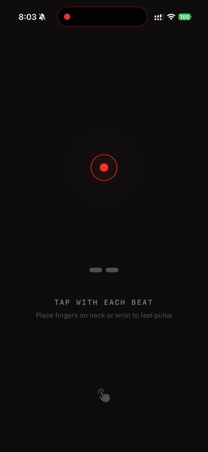

  

<h1 align="center">Pulse</h1>

Measure heart rate by tapping the screen in rhythm with a pulse you feel. 
No sensors, no cameras, no math. Just tap and read.

<strong>Version 0.1</strong> · iOS 17+ · Swift + SwiftUI

  

## About

Sometimes you need to check a heart rate and you don't have a smartwatch or sensor handy. Pulse is a simple way to do it. Feel the pulse on the neck or wrist, tap the screen with each beat, and read the BPM.

## Features

- Tap anywhere on screen to measure BPM in real-time
- Haptic feedback per tap so you can stay focused on the pulse
- Auto-resets after a few seconds of inactivity

## How to run

1. Open `Pulse.xcodeproj` in Xcode
2. Select your iPhone as the run destination
3. Build and run (Cmd+R)

No dependencies, no packages, no API keys.

## License

[MIT](LICENSE)

---

Made by [santiagoalonso.com](https://santiagoalonso.com)
